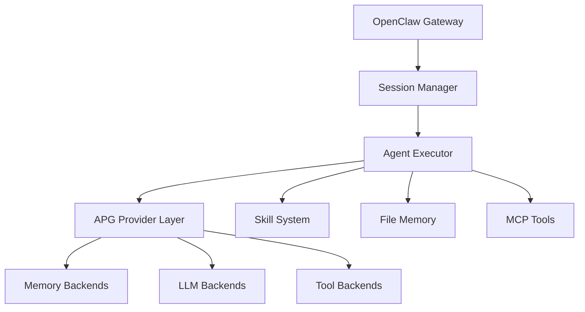

# OpenClaw vs Agentic Primitives Gateway Comparison

## Architectural Philosophy

### OpenClaw
- **Event-driven agent orchestration** with session isolation
- **MCP tool integration** for standardized tool access  
- **File-based memory system** (MEMORY.md, daily logs)
- **Single-writer concurrency model** with lane-aware queues
- **Skill system** for on-demand instruction loading

### Agentic Primitives Gateway  
- **REST API abstraction layer** for infrastructure primitives
- **Pluggable provider backends** with runtime switching
- **Declarative agent definitions** in YAML
- **Multi-agent orchestration** with team coordination
- **Unified primitive interface** across vendors

## Key Differences

| Aspect | OpenClaw | Agentic Primitives Gateway |
|--------|----------|----------------------------|
| **Primary Focus** | Agent orchestration & execution | Infrastructure abstraction |
| **Memory Model** | File-based, transparent | Pluggable providers (vector DB, managed) |
| **Agent Definition** | Code + skills + context files | YAML declarative specs |
| **Tool Integration** | MCP standard | Provider-specific implementations |
| **Concurrency** | Session-isolated, single-writer | Multi-session, provider-dependent |
| **Deployment** | Single binary + workspace | Gateway service + backends |

## Complementary Strengths

### What APG Does Better
1. **Vendor Abstraction**: Clean interfaces for swapping AI providers
2. **Enterprise Ready**: Multi-tenant, RBAC, policy enforcement
3. **Team Coordination**: Built-in multi-agent collaboration patterns
4. **Scalability**: Designed for distributed deployments

### What OpenClaw Does Better  
1. **Developer Experience**: Immediate productivity with minimal setup
2. **Transparency**: File-based memory is inspectable and debuggable
3. **Flexibility**: Dynamic skill loading and context assembly
4. **Real-world Integration**: Direct access to shell, files, messaging

## Potential Integration Points

### OpenClaw → APG Integration
```python
# OpenClaw could use APG as a provider abstraction layer
class APGMemoryTool:
    async def remember(self, key: str, content: str):
        response = await self.apg_client.post("/api/v1/memory/store", {
            "namespace": f"openclaw:{self.session_id}",
            "key": key, 
            "content": content
        })
        return response
```

### APG → OpenClaw Integration  
```yaml
# APG could define OpenClaw as a code interpreter provider
code_interpreter:
  backends:
    openclaw:
      backend: "apg.providers.openclaw.OpenClawCodeProvider" 
      config:
        gateway_url: "ws://openclaw:18789"
```

## Architecture Lessons

### For OpenClaw Evolution
1. **Provider Abstraction**: Consider abstracting memory backends (file, database, cloud)
2. **Team Patterns**: APG's team coordination could inspire sub-agent orchestration
3. **Runtime Configuration**: Header-based provider routing is elegant
4. **Declarative Agents**: YAML agent specs could complement code-based definitions

### For APG Enhancement  
1. **Session Isolation**: OpenClaw's lane-aware queuing prevents state corruption
2. **Transparent Memory**: File-based memory is easier to debug than black-box providers
3. **Dynamic Loading**: Skill-style dynamic capability loading vs static provider registration
4. **Event Architecture**: Event-driven patterns for better real-time responsiveness

## Hybrid Architecture Concept

A potential fusion would combine the best of both:



**Key Features**:
- OpenClaw's event-driven orchestration with session isolation
- APG's provider abstraction for infrastructure flexibility  
- File-based memory for transparency + vector providers for semantic search
- MCP tools + APG primitive abstractions
- Skill system + declarative agent specs

## Implementation Roadmap

### Phase 1: Provider Abstraction in OpenClaw
- Abstract memory interface (file, redis, vector DB)
- Abstract LLM interface (bedrock, openai, local)
- Header-based provider routing

### Phase 2: APG Integration
- APG memory provider for semantic search
- APG LLM provider for model routing
- Maintain file memory as default for transparency

### Phase 3: Advanced Orchestration  
- Multi-agent teams using APG patterns
- Cross-gateway communication for distributed agents
- Unified observability across both systems

## Conclusion

Both systems address different layers of the AI agent stack:

- **OpenClaw**: Focuses on agent execution, reasoning loops, and real-world integration
- **APG**: Focuses on infrastructure abstraction, multi-tenancy, and vendor flexibility

They're complementary rather than competitive. OpenClaw could benefit from APG's provider abstraction patterns, while APG could learn from OpenClaw's session management and transparent debugging approaches.

The future likely involves combining both approaches - event-driven agent orchestration with pluggable infrastructure backends, maintaining both transparency for debugging and flexibility for deployment.